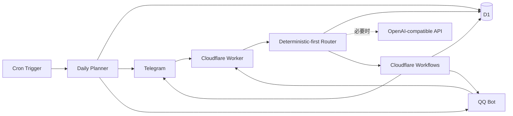

# Composa（拾序）

> Compose what matters. Find your order.
> 拾起零碎，归之有序。

Composa 来自 **compose + persona**。它是一个长期待在聊天工具里的轻量个人秘书：把随手发来的链接、研究想法、待办和 deadline 接住，理解后存进自己的数据库，在需要时重新找到或提醒你。

它刻意不是一个会操作电脑、浏览器或 shell 的通用自主 Agent。核心链路只有：

```text
接住 → 理解 → 保存 → 整理 → 规划 → 提醒 → 检索
```

## 能力

- Telegram 与 QQ 双通道，自然语言直接输入，不要求命令格式
- Resource、Idea、Task、Project/Deadline、Query 五类核心意图
- D1 作为唯一 source of truth，保留用户原文与 AI enrichment 的边界
- 中文/英文常见相对时间的确定性解析，默认 `Asia/Singapore`
- Cloudflare Workflows 一次性提醒与少量 deadline milestones
- Cron 驱动、D1 事实驱动的简洁 Daily Plan
- `Done`、`Later`、`Reschedule`、`Details` 交互按钮
- OpenAI-compatible API，可关闭、可限额、没有未经配置的付费 fallback
- Webhook 验证、用户 allowlist、事件去重、有限重试和结构化脱敏日志
- URL best-effort 抓取；网页失败也会先保存原始消息和 URL

## 架构



详细设计见 [架构说明](docs/architecture.md)。

## 快速开始

前置条件：Node.js 22+、Cloudflare 账号，以及至少一个 Telegram/QQ Bot。

```bash
npm ci
cp .dev.vars.example .dev.vars
npm run db:migrate:local
npm run dev
```

本地 Worker 默认由 Wrangler 输出访问地址。公开健康检查：

```bash
curl http://127.0.0.1:8787/health
```

完整上线步骤见 [Cloudflare 部署指南](docs/deployment.md)。部署后再按需完成：

- [Telegram 接入](docs/telegram.md)
- [QQ Bot 接入](docs/qq.md)
- [数据库备份与恢复](docs/backup.md)

## 配置

非敏感变量在 `wrangler.jsonc` 的 `vars` 中维护：

| 变量 | 默认值 | 用途 |
|---|---:|---|
| `TIMEZONE` | `Asia/Singapore` | 时间解析与 Daily Plan 时区 |
| `DAILY_PLAN_TIME` | `08:00` | 当地每日计划时间；Cron 在其后的首个 15 分钟刻度发送 |
| `DAILY_PLAN_TARGETS` | 空 | 如 `telegram:123456,qq:OPENID` |
| `AI_BASE_URL` | `https://api.openai.com/v1` | OpenAI-compatible API 根地址 |
| `AI_MODEL` | `gpt-4.1-mini` | Chat Completions 模型名 |
| `AI_EMBEDDING_MODEL` | 空 | 第二阶段预留，MVP 不使用 |
| `AI_MAX_TOKENS` | `600` | 单次输出上限 |
| `AI_TIMEOUT_MS` | `15000` | 单次 AI 请求超时 |
| `AI_DAILY_REQUEST_LIMIT` | `100` | 按新加坡本地日期统计的日请求上限 |
| `URL_FETCH_TIMEOUT_MS` | `6000` | 网页获取超时 |
| `URL_MAX_BYTES` | `524288` | 网页最大读取字节数 |
| `TELEGRAM_ALLOWED_USER_IDS` | 空 | 逗号分隔 Telegram user ID allowlist |
| `QQ_ALLOWED_USER_OPENIDS` | 空 | 逗号分隔 QQ `user_openid` allowlist |
| `QQ_APP_ID` | 空 | QQ Bot App ID |
| `QQ_API_BASE_URL` | 官方地址 | QQ OpenAPI 根地址 |

敏感值只通过 `wrangler secret put` 或本地 `.dev.vars` 提供：

| Secret | 用途 |
|---|---|
| `AI_API_KEY` | AI Provider；留空即完全禁用 AI |
| `TELEGRAM_BOT_TOKEN` | Telegram Bot API |
| `TELEGRAM_WEBHOOK_SECRET` | Telegram webhook header 校验 |
| `QQ_BOT_SECRET` | QQ Ed25519 webhook 验签/挑战签名 |
| `QQ_CLIENT_SECRET` | 获取 QQ App Access Token |
| `ADMIN_API_TOKEN` | `/api/*` Bearer token |

仓库不会提交 `.dev.vars`、`.env*`、备份文件或真实 credential。

## HTTP 接口

| Method | Path | 权限 | 说明 |
|---|---|---|---|
| `GET` | `/health` | 公开 | D1 与通道配置状态，不返回秘密 |
| `POST` | `/webhooks/telegram` | Telegram secret + allowlist | Telegram update |
| `POST` | `/webhooks/qq` | App ID + Ed25519 + allowlist | QQ challenge/event |
| `GET` | `/api/items` | Admin Bearer | `type`、`status`、`q`、`limit` 查询 |
| `GET` | `/api/items/:id` | Admin Bearer | 单项详情 |
| `POST` | `/api/items/:id/complete` | Admin Bearer | 标记完成 |
| `POST` | `/api/daily-plan` | Admin Bearer | 预览；加 `?send=1` 排队发送 |

## 验证

```bash
npm run check
npm run deploy:dry
```

测试运行在真实 Workers runtime + 本地隔离 D1 中，覆盖意图到业务写入、CRUD、重复 webhook、提醒调度、callback、相对时间/时区、deadline milestones、Telegram/QQ 授权与 QQ 官方 Ed25519 challenge 向量、URL 安全、查询和 Daily Plan。

## 项目结构

```text
src/
  ai/             Provider abstraction 与 OpenAI-compatible 实现
  channels/       Telegram / QQ adapters
  core/           路由、业务执行、时间、提醒、Daily Plan
  db/             参数化 D1 repositories
  http/           Worker 路由与有限 body reader
  security/       token 比较与 SSRF 防护
  url/            有界网页获取与 metadata 抽取
  workflows/      durable reminder workflow
migrations/       版本化 D1 schema
test/             Workers runtime 自动化测试
docs/             接入、架构、部署与运维文档
scripts/          webhook、smoke test、备份脚本
```

## MVP 边界

Vectorize、Google Calendar、WhatsApp/企业微信、订阅制模型 runtime、网页 UI 与复杂 RAG 都不阻塞当前版本。`embedding_id` 已预留，但没有 Vectorize 时全部核心能力仍然可用。
