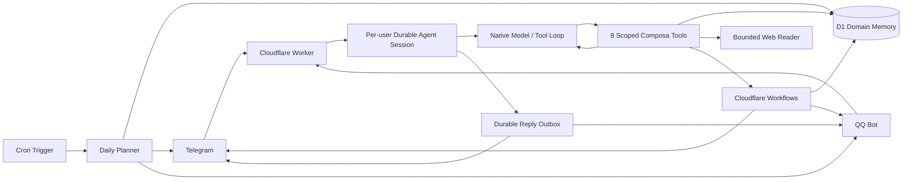

# Composa（拾序）

> Compose what matters. Find your order.
> 拾起零碎，归之有序。

Composa 来自 **compose + persona**。它是一个长期待在聊天工具里的轻量个人 Agent：每个用户拥有一条持久、串行的会话，模型可以在同一轮里反复读取记忆、网页与日程，再调用受控工具完成任务。

它刻意不是一个会任意操作电脑、浏览器或 shell 的通用自主 Agent，但保留了 Agent 最重要的观察、推理、工具执行和持久记忆闭环。核心链路是：

```text
接住 → 恢复会话 → 模型选择工具 → 观察结果 → 继续选择工具 → 回复与跟进
```

## 能力

- Telegram 与 QQ 双通道，自然语言直接输入，不要求命令格式
- OpenClaw 式原生工具循环：模型每看到一次工具结果都能继续判断下一步，不把复杂要求压缩成一个固定 intent
- 每个 `channel + user` 一条 Durable Object 会话；消息串行、调用可恢复、写操作有幂等键，平台重复投递不会重复执行
- 自然语言完成、舍弃、恢复和修改已有事项；支持一句话执行多个动作，状态变化不会复制出新待办
- D1 保存事项、提醒和审计事实，Durable Object 保存 Agent 会话与投递状态；保留用户原文与 AI enrichment 的边界
- AI-first 自然语言理解：中文数字、口语时间、指代、事项时间与提醒时间由模型统一解释
- 默认把可行动消息理解为“现在暂存、稍后再做”，由模型选择真正有行动价值的未来提醒时间
- 区分稍后行动、事件前、到期和明确的即时提醒；确认消息分别展示提醒与截止时间
- 新建或改动提醒时读取该用户在 Composa 内的事项与提醒日程，自动绕开撞期并告知实际选定时间
- Cloudflare Workflows 一次性提醒；提醒策略由模型根据事项语义和期限决定，不按项目类型硬塞固定里程碑
- Cron 驱动、D1 事实驱动的简洁 Daily Plan
- `完成`、`舍弃`、`稍后`、`改期`、`详情` 交互按钮；舍弃只归档，可随时恢复
- OpenAI-compatible API，可关闭、可限额、没有未经配置的付费 fallback
- Webhook 验证、用户 allowlist、事件去重、有限重试和结构化脱敏日志
- 内置基础网页阅读工具：发现普通 URL 后有界抓取正文、标题和来源；登录/验证页面诚实降级
- QQ 分享卡片同时读取预览、隐藏字段与附件，能取得正常 URL 时继续读取原网页
- 含链接的消息由模型按真实指令选择是否读取；无需为论文、招聘、活动等内容分别编写业务分支
- 后续只说“根据刚才的链接更新”也能在同一轮组合 `memory_search → item_get → web_read → item_update`，并更新原记录
- 查询、网页分析、记录更新、生命周期和提醒都使用同一工具循环；所有权、SSRF、时间合法性、冲突与预算仍由代码硬校验

## 架构



详细设计见 [架构说明](docs/architecture.md)。

## 快速开始

前置条件：Node.js 22+、Cloudflare 账号，以及至少一个 Telegram/QQ Bot。

```bash
npm ci
cp .dev.vars.example .dev.vars
npm run db:migrate:local
npm run dev
```

本地 Worker 默认由 Wrangler 输出访问地址。公开健康检查：

```bash
curl http://127.0.0.1:8787/health
```

完整上线步骤见 [Cloudflare 部署指南](docs/deployment.md)。部署后再按需完成：

- [Telegram 接入](docs/telegram.md)
- [QQ Bot 接入](docs/qq.md)
- [数据库备份与恢复](docs/backup.md)

## 配置

非敏感变量可在 Cloudflare Dashboard 的 **Variables and secrets** 中维护；项目开启了 `keep_vars`，后续部署会保留面板值。未设置时使用下列默认值：

| 变量 | 默认值 | 用途 |
|---|---:|---|
| `TIMEZONE` | `Asia/Singapore` | 时间解析与 Daily Plan 时区 |
| `DAILY_PLAN_TIME` | `08:00` | 当地每日计划时间；Cron 在其后的首个 15 分钟刻度发送 |
| `DAILY_PLAN_TARGETS` | 空 | 如 `telegram:123456,qq:OPENID` |
| `AI_BASE_URL` | `https://api.openai.com/v1` | OpenAI-compatible API 根地址 |
| `AI_MODEL` | `gpt-4.1-mini` | 支持 OpenAI tool calls 的模型名 |
| `AI_EMBEDDING_MODEL` | 空 | 第二阶段预留，MVP 不使用 |
| `AI_MAX_TOKENS` | `600` | 单次输出上限 |
| `AI_TIMEOUT_MS` | `15000` | 单次 AI 请求超时 |
| `AI_DAILY_REQUEST_LIMIT` | `100` | 按新加坡本地日期统计的日请求上限 |
| `URL_FETCH_TIMEOUT_MS` | `6000` | 网页获取超时 |
| `URL_MAX_BYTES` | `524288` | 网页最大读取字节数 |
| `TELEGRAM_ALLOWED_USER_IDS` | 空 | 逗号分隔 Telegram user ID allowlist |
| `QQ_ALLOWED_USER_OPENIDS` | 空 | 逗号分隔 QQ `user_openid` allowlist |
| `QQ_APP_ID` | 空 | QQ Bot App ID |
| `QQ_API_BASE_URL` | 官方地址 | QQ OpenAPI 根地址 |

敏感值只通过 `wrangler secret put` 或本地 `.dev.vars` 提供：

| Secret | 用途 |
|---|---|
| `AI_API_KEY` | AI Provider；留空即完全禁用 AI |
| `TELEGRAM_BOT_TOKEN` | Telegram Bot API |
| `TELEGRAM_WEBHOOK_SECRET` | Telegram webhook header 校验 |
| `QQ_APP_SECRET` | QQ 开放平台 AppSecret；用于 Webhook 签名与获取 App Access Token |
| `ADMIN_API_TOKEN` | `/api/*` Bearer token |

仓库不会提交 `.dev.vars`、`.env*`、备份文件或真实 credential。

## HTTP 接口

| Method | Path | 权限 | 说明 |
|---|---|---|---|
| `GET` | `/health` | 公开 | D1、通道及 AI `configured/verified` 状态，不返回秘密 |
| `POST` | `/webhooks/telegram` | Telegram secret + allowlist | Telegram update |
| `POST` | `/webhooks/qq` | App ID + Ed25519 + allowlist | QQ challenge/event |
| `GET` | `/api/items` | Admin Bearer | `type`、`status`、`q`、`limit` 查询 |
| `GET` | `/api/items/:id` | Admin Bearer | 单项详情 |
| `POST` | `/api/items/:id/complete` | Admin Bearer | 标记完成并取消待发送提醒 |
| `POST` | `/api/items/:id/archive` | Admin Bearer | 舍弃/归档并取消待发送提醒 |
| `POST` | `/api/items/:id/restore` | Admin Bearer | 恢复为 open |
| `POST` | `/api/daily-plan` | Admin Bearer | 预览；加 `?send=1` 排队发送 |

## 验证

```bash
npm run check
npm run deploy:dry
```

测试运行在真实 Workers runtime + 本地隔离 D1/Durable Object 中，覆盖原生多步工具循环、会话运行时约束、记忆检索、网页读取、原记录更新、完成/舍弃/恢复、提醒避让、用户隔离、重复 webhook、Workflow、callback、时区、Telegram/QQ 授权、QQ 卡片 URL 与 Daily Plan。

## 项目结构

```text
src/
  agent/          Durable Agent 会话、原生工具循环、工具策略与回复 outbox
  ai/             Daily Plan 等非会话 AI 能力与 OpenAI-compatible 实现
  channels/       Telegram / QQ adapters
  core/           路由、业务执行、时间、提醒、Daily Plan
  db/             参数化 D1 repositories
  http/           Worker 路由与有限 body reader
  security/       token 比较与 SSRF 防护
  url/            基础网页阅读工具：URL 发现、有界获取、正文与 metadata 抽取
  workflows/      durable reminder workflow
migrations/       版本化 D1 schema
test/             Workers runtime 自动化测试
docs/             接入、架构、部署与运维文档
scripts/          webhook、smoke test、备份脚本
```

## MVP 边界

当前的“日程”来自 Composa 自己保存的事项与提醒；尚未读取 Google Calendar 等外部日历。Think 运行时目前仍是实验性依赖，因此被隔离在 `src/agent/`，事项与提醒继续以 D1 为业务事实源。Composa 有意不提供任意 shell、浏览器控制、MCP、插件市场、多 Agent 编排、网页 UI 与复杂 RAG；这些重量不是个人助理核心闭环的前提。
