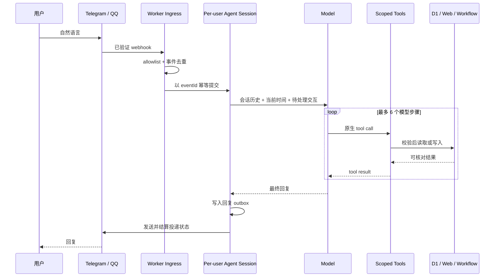

# Composa v2 架构说明

## 设计取舍

Composa v2 从 OpenClaw 的实现出发做减法，而不是继续扩充意图分类器。保留的是让 Agent 真正具备组合能力的内核：每个会话串行处理、模型原生选择工具、工具结果回到同一轮上下文、持久状态、幂等写入、生命周期观测和可靠投递。

省去的是个人助理当前不需要或 Cloudflare Workers 不适合承载的重量：任意 shell 与浏览器控制、MCP、插件市场、多 Agent 编排、本机工作区、复杂模型路由和通用 Gateway。

关键边界仍然是：**模型负责理解与组合，代码负责权限与事实。**

- 模型可以根据每次工具结果决定下一步，不需要先选一个 `intent`。
- 代码硬性限制可用工具、当前用户所有权、参数 schema、幂等、SSRF、提醒合法性、冲突、预算与最长步数。
- D1 是事项、提醒和审计的业务事实源；Durable Object 保存会话运行状态和回复 outbox。
- 固定 callback、Webhook 验签、Workflow 与 Daily Plan 继续走确定性链路。
- AI 未配置、超预算或失败时明确说明，不擅自把消息保存成记录，也不切换未经配置的付费模型。

## 一轮消息如何运行



会话 ID 是 `channel + userId` 的哈希，因此同一用户的消息排队处理，不会出现两个并发回合同时修改“刚才那个”。平台重复投递同一事件时，D1 inbox、Think submission 和写工具分别使用稳定幂等键。

## Agent 能看到的工具

运行时只开放八个应用工具：

| 工具 | 用途 |
|---|---|
| `memory_search` | 搜索当前用户的事项，解析“刚才那个”等指代 |
| `item_get` | 读取一个确定事项及其提醒 |
| `web_read` | 读取最多三个普通公开网页，或读取事项中保存的链接 |
| `schedule_list` | 查看当前用户未来日程与提醒窗口 |
| `item_create` | 新建真正的新事项 |
| `item_update` | 更新原事项及结构化事实、来源 |
| `item_transition` | 完成、舍弃/归档、恢复 |
| `reminder_manage` | 设置、改期或取消提醒 |

模型没有 bash、文件系统、MCP 或任意网络请求能力。读取工具先从当前会话身份取得 `channel + userId`；写工具还要求运行时权限，并为每个动作生成稳定幂等键。

例如“根据刚才的链接内容更新一下深圳理工大学的招聘信息”不对应某个复合意图。典型执行链是：

```text
memory_search → item_get → web_read → item_update → 自然语言说明改了什么
```

模型可以根据搜索和网页结果改变下一步；代码只校验目标确实属于当前用户、网页公开可读、更新字段合规。

## 数据与运行状态

- `items`：resource、idea、task、note、project 的统一对象。`raw_message` 保留用户原文，`ai_enrichment` 保存网页事实。
- `reminders`：提醒时间、通道目标、Workflow 与投递状态。
- `messages`：Webhook 事件去重、处理状态、错误和回复审计。
- `pending_actions`：按钮“改期”后的短期上下文，由下一轮 Agent 直接取得精确 item ID。
- `daily_plan_runs`、`ai_usage`：每日计划幂等与 AI 预算。
- Durable Object SQLite：Think 会话状态、submission 状态，以及 Composa 自己的 turn-origin / reply-outbox 表。

Think 是实验性依赖，限定在 `src/agent/` 内。即使未来替换运行时，D1 里的事项与提醒无需迁移；HTTP ingress 只依赖 `receive()` 这一层应用接口。

## 网页、提醒与生命周期

`web_read` 只接受普通公开 HTTP(S) 地址，手动验证每次跳转，限制超时、正文类型、体积和每轮数量，不绕过登录、验证码或反爬。网页正文被视为不可信证据，不能授予权限，也不能覆盖用户指令。

提醒由模型理解自然语言并选择绝对时间；代码拒绝过去时间和非明确要求的近乎即时提醒。模型自主选时间时应先调用 `schedule_list`，冲突结果会返回给同一轮模型重新判断。提醒写入 D1 后由 Cloudflare Workflow 持久等待；完成或舍弃事项会取消未发送提醒。

生命周期不是创建新待办：对已有事项的完成、舍弃、恢复和修改都必须先解析到原 item ID，再调用对应工具。小歧义由模型做可逆判断，只有多个目标同样合理且误操作代价明显时才追问。

## Daily Plan 与固定回调

Daily Plan 仍由 Cron 每 15 分钟检查本地配置时间，并通过 `daily_plan_runs` 保证每个目标每天最多成功一次。它从 D1 读取当前用户真实事项，AI 只负责取舍和表达。

按钮 callback 已携带明确动作和 item ID，不需要浪费一次 Agent 回合。`完成`、`舍弃`、`稍后`、`改期`、`详情` 继续由确定性处理器执行；其中“改期”写入 `pending_actions`，下一句自然语言进入 Agent 会话。

## 安全、成本与已知边界

- 所有 SQL 参数化；所有业务读写按 `channel + userId` 隔离。
- Telegram secret、Admin token 与 QQ Ed25519 验签保持在 Agent 入口之外。
- 单回合最多 6 个模型步骤，每步和工具都有超时，每日请求计入同一预算。
- 回复先记入 DO outbox 再调用平台；失败可在重复 webhook 时恢复。
- 外部聊天平台不存在跨系统原子事务：若平台已接受消息而 Worker 在落账前崩溃，仍可能出现极低概率重复投递，这是当前的分布式系统边界。
- 当前日程只包含 Composa 自己的事项与提醒，尚未接入外部 Calendar。

完整 OpenClaw 对照研究见 [研究报告](research/openclaw-composa-v2-2026-08-16/report.md)，迁移步骤见 [实施计划](superpowers/plans/2026-08-16-composa-v2-openclaw-runtime.md)。
